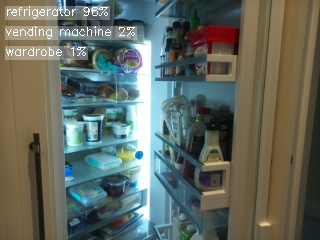
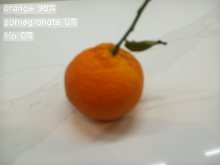
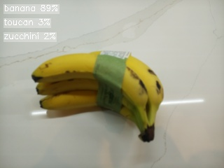
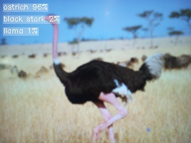
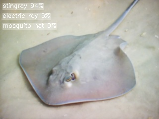
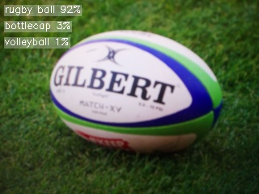
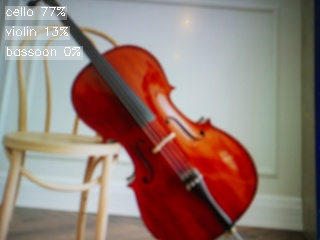

# picam

Raspberry Pi AI camera for edge computer vision, with a small display and battery.

## Hardware

- [Raspberry Pi Zero 2 W](https://www.raspberrypi.com/products/raspberry-pi-zero-2-w/) with headers
- [Raspberry Pi AI Camera](https://www.raspberrypi.com/products/ai-camera/)
- [Pimoroni Display HAT Mini](https://shop.pimoroni.com/products/display-hat-mini)
- [Waveshare UPS HAT (C)](https://www.waveshare.com/ups-hat-c.htm)

## Software

Follow the [official docs](https://www.raspberrypi.com/documentation/computers/getting-started.html#installing-the-operating-system) to install **Raspberry Pi OS (Legacy, 64-bit) Lite** using Raspberry Pi Imager. Configure your Wi-Fi credentials and enable SSH before flashing.

### System setup

Update the system:

```shell
sudo apt update && sudo apt full-upgrade
```

Enable I2C and SPI for the display and battery:

```shell
sudo raspi-config nonint do_i2c 0
sudo raspi-config nonint do_spi 0
```

Reboot:

```shell
sudo systemctl reboot
```

### Dependencies

Install the system packages picam depends on:

```shell
sudo apt install git imx500-all python3-lgpio python3-munkres python3-picamera2 python3-smbus2 
```

### Installation

Clone the repo:

```shell
git clone https://github.com/mikejovyan/picam.git ~/picam
```

Create a virtual environment:

```shell
python -m venv --system-site-packages ~/picam/.venv
```

Install the picam package:

```shell
~/picam/.venv/bin/pip install ~/picam
```

Enable linger so the user systemd service starts at boot without an active login session:

```shell
loginctl enable-linger
```

Copy the systemd service file:

```shell
mkdir -p ~/.config/systemd/user
cp ~/picam/picam.service ~/.config/systemd/user/picam.service
```

Enable and start the service:

```shell
systemctl --user daemon-reload && systemctl --user enable --now picam
```

## Controls

| Button | Action |
|--------|--------|
| A | Switch AI model |
| B | Show/hide model info overlay |
| X | Capture image (saved to `~/picam/pictures/`) |
| Y | Exit |

## Examples

| | | |
|---|---|---|
|  |  |  |
|  |  |  |
|  |  | |
